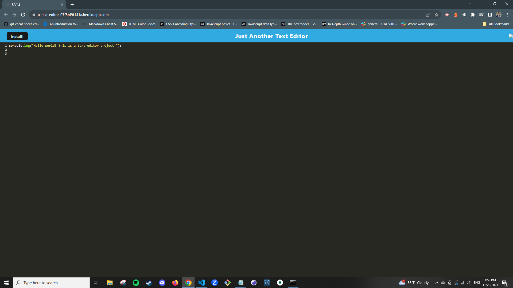

# Description

This is a project that utilizes webpack and database configurations to build and create an in-browser text editor.

## Deployed Application Link

https://a-text-editor-07f8bf9f141a.herokuapp.com/

## Installation

- NPM
- Express v.4.17.1
- If-ENV v.1.0.4
- Nodemon v.2.0.4
- Babel v.7.15.0
- Webpack

## LICENSE

Refer to LICENSE

## Resources

- https://webpack.js.org/concepts/
- https://expressjs.com/en/starter/basic-routing.html
- UT Austin Coding Bootcamp curriculum

## Screenshot

